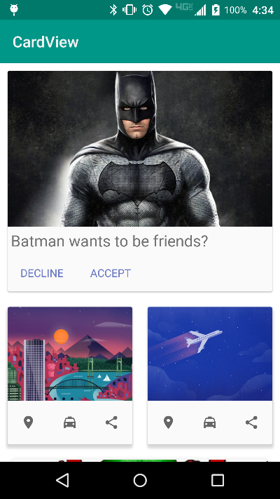
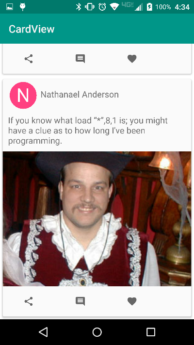
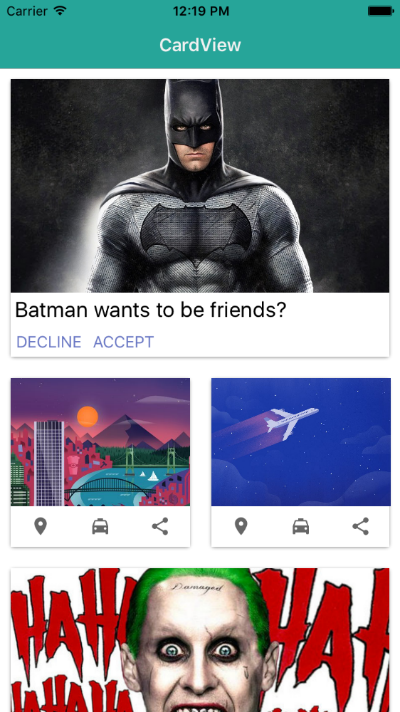
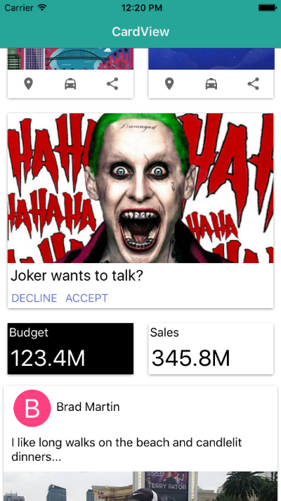
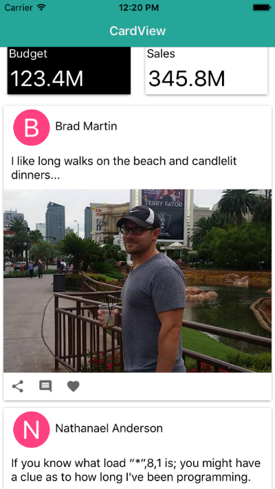
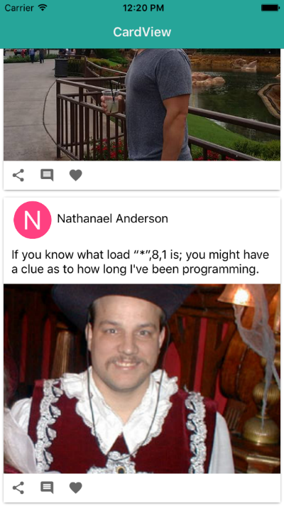

[](https://www.npmjs.com/package/nativescript-cardview)
[](https://www.npmjs.com/package/nativescript-cardview)

# NativeScript CardView :diamonds: :clubs:

A NativeScript plugin to provide an XML widget to implement the Material Design CardView component.

##### [Material Design Card Spec](https://www.google.com/design/spec/components/cards.html)
##### [CardView Android Documentation](http://developer.android.com/intl/zh-tw/reference/android/support/v7/widget/CardView.html) 
##### iOS version uses the [MaterialCard](https://cocoapods.org/pods/MaterialCard) pod by [Nathan Walker](https://github.com/NathanWalker)


## Installation
`npm install nativescript-cardview`

## Usage

 <span style="color:red">IMPORTANT: </span>*Make sure you include `xmlns:Card="nativescript-cardview"` on the Page element*

###
```XML
<Page xmlns:Card="nativescript-cardview">
   <StackLayout>     
      <Card:CardView margin="10">
           <grid-layout rows="200, auto, auto" columns="auto, auto, *">
               <image src="~/images/batman.jpg" stretch="aspectFill" colSpan="3" row="0" />
               <label text="Batman wants to be friends?" class="info" textWrap="true" row="1" colSpan="3" />          
               <button text="DECLINE" tap="goAway" class="clear-btn blue" row="2" col="0" />
               <button text="ACCEPT" class="clear-btn blue" row="2" col="1" />
           </grid-layout>
       </Card:CardView>
   </StackLayout>
</Page>
```

## Attributes

* **radius** *optional*

An attribute to control the 'border-radius' of the card.

* **backgroundColor** *optional*

This uses the internal backgroundColor stying provided by NativeScript, but I wanted to point out that if you apply this
you will lose any elevation and radius property set. This could be enhanced in the future to override the NativeScript styling
to use the native method available on the CardView component.

### Platform specific options

#### Android

* **elevation** *optional*

 An attribute to set the elevation of the card. This will increase the 'drop-shadow' of the card.
There can be some performance impact when using a very high elevation value.

#### iOS

* **shadowOffsetWidth** *optional*

An attribute to offset the x position of the shadow behind the card.
 
* **shadowOffsetHeight** *optional*

An attribute to offset the y position of the shadow behind the card.

* **shadowColor** *optional*

An attribute to set the color of the shadow behind the card.

* **shadowOpacity** *optional*

An attribute to set the opacity of the shadow behind the card.

The default values are set to:
``` 
radius = 2;
shadowOffsetWidth = 0;
shadowOffsetHeight = 2;
shadowColor = new Color('#000').ios
shadowOpacity = 0.4;
```

## Sample Screenshots

#### Android

Sample 1 |  Sample 2
-------- | ---------
 | 

Sample 3 | Sample 4
-------- | -------
 | 

#### iOS

Sample 1 |  Sample 2
-------- | ---------
 | 

Sample 3 | Sample 4
-------- | -------
 | 

#### Contributing
[Please follow here](https://github.com/bradmartin/nativescript-cardview/blob/master/CONTRIBUTING.md)

#### Contributors
- [NathanaelA](https://github.com/NathanaelA)
- [NathanWalker](https://github.com/NathanWalker)
